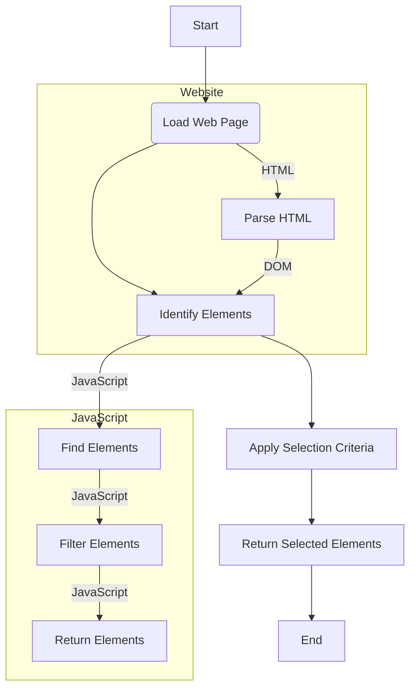

# Finding Elements in a Web Page 

The `document` object represents the HTML document. It is the entry point to the web page. The `document` object has methods and properties that allow you to find elements in a web page.

## Document Object Model (DOM)



## Finding Elements by ID

The `getElementById` method returns the element with the specified ID. The `id` attribute is used to specify the ID of an HTML element. The `getElementById` method is called on the `document` object.

```html
<!DOCTYPE html>
<html>
<head>
    <title>Finding Elements by ID</title>
</head>
<body>
    <h1 id="demo">Hello, world!</h1>
    <script>
        document.getElementById("demo").innerHTML = "Hello, world!";
    </script>
</body>
</html>
```

In this example, the `document` object represents the HTML document. The `getElementById` method returns the element with the specified ID. The `innerHTML` property sets or returns the HTML content (inner HTML) of an element.

## Finding Elements by Tag Name

The `getElementsByTagName` method returns a collection of all elements with the specified tag name. The `getElementsByTagName` method is called on the `document` object.

```html
<!DOCTYPE html>
<html>
<head>
    <title>Finding Elements by Tag Name</title>
</head>
<body>
    <h1>Hello, world!</h1>
    <p>Hello, world!</p>
    <script>
        const x = document.getElementsByTagName("p");
        document.write(x[0].innerHTML, ' ', `(Came from Dom element)`);
    </script>
</body>
</html>
```

In this example, the `document` object represents the HTML document. The `getElementsByTagName` method returns a collection of all elements with the specified tag name. The `document.write` method writes HTML expressions or JavaScript code to a document.


## Finding Elements by Class Name

The `getElementsByClassName` method returns a collection of all elements with the specified class name. The `getElementsByClassName` method is called on the `document` object.

```html
<!DOCTYPE html>
<html>
<head>
    <title>Finding Elements by Class Name</title>
</head>
<body>
    <h1 class="demo">Hello, world!</h1>
    <h1 class="demo">Hello, world!</h1>
    <script>
        const x = document.getElementsByClassName("demo");
        document.write(x[0].innerHTML, ' ', `(Came from Dom element)`);
    </script>
</body>
</html>
```

In this example, the `document` object represents the HTML document. The `getElementsByClassName` method returns a collection of all elements with the specified class name. The `document.write` method writes HTML expressions or JavaScript code to a document.

## Finding Elements by CSS Selector

The `querySelector` method returns the first element that matches a specified CSS selector. The `querySelector` method is called on the `document` object.

```html
<!DOCTYPE html>
<html>
<head>
    <title>Finding Elements by CSS Selector</title>
</head>

<body>
    <h1 class="demo">Hello, world!</h1>
    <h1 class="demo">Hello, world!</h1>
    <script>
        const x = document.querySelector("h1");
        document.write(x.innerHTML, ' ', `(Came from Dom element)`);
    </script>
</body>

</html>
```

In this example, the `document` object represents the HTML document. The `querySelector` method returns the first element that matches a specified CSS selector. The `document.write` method writes HTML expressions or JavaScript code to a document.

## Conclusion

The `document` object represents the HTML document. It is the entry point to the web page. The `document` object has methods and properties that allow you to find elements in a web page.

## References

- [W3Schools](https://www.w3schools.com/js/js_htmldom.asp)
- [MDN Web Docs](https://developer.mozilla.org/en-US/docs/Web/API/Document_Object_Model/Introduction)
- [GeeksforGeeks](https://www.geeksforgeeks.org/dom-document-object-model/)